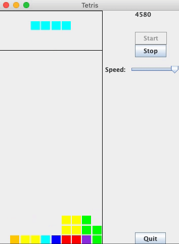

# Tetris Machine Learning AI
I designed and fully implemented Tetris. Included an AI that was optimized by creating a Genetic Algorithm.

## General AI Design
My AI chooses the optimal move by scoring all of the possible moves based on a set of board-state heuristics. They are as follows:
* Aggregate Height
* Bumpiness
* Holes
* Rows Cleared

The score of each move is calculated by taking each of the above values, multiplying them by a coefficient, and then summing them up.

## Optimization with Genetic Algorithm
To optimize the above coefficients, I created a class called `GalacticBrain`, that simulates the process of natural selection. The setup I chose was:
* Crossover Rate = 30%
* Mutation Rate = 5%

## Results
The AI plays over 100,000 moves! Below is a gif showing the AI at work!

